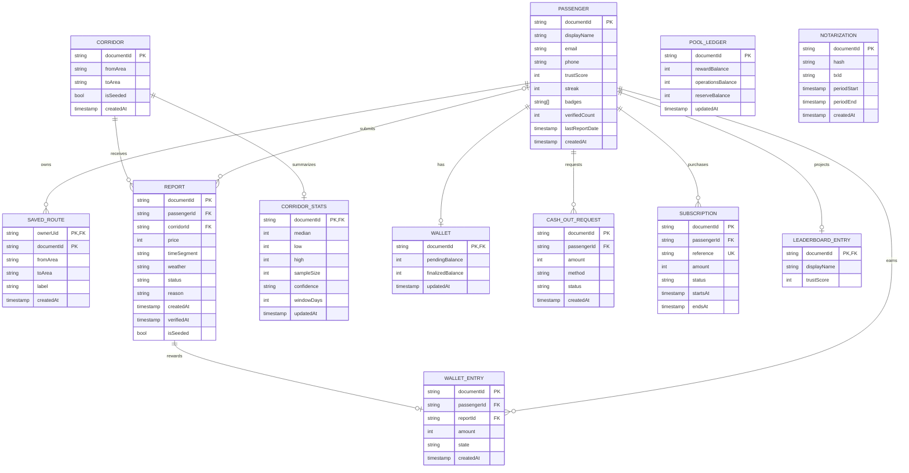

```mermaid
erDiagram
    direction TB

    PASSENGER ||--o{ SAVED_ROUTE : owns
    PASSENGER o|--o{ REPORT : submits
    CORRIDOR ||--o{ REPORT : receives
    CORRIDOR ||--o| CORRIDOR_STATS : summarizes
    PASSENGER ||--o| WALLET : has
    PASSENGER ||--o{ WALLET_ENTRY : earns
    REPORT ||--o| WALLET_ENTRY : rewards
    PASSENGER ||--o{ CASH_OUT_REQUEST : requests
    PASSENGER ||--o{ SUBSCRIPTION : purchases
    PASSENGER ||--o| LEADERBOARD_ENTRY : projects

    PASSENGER {
        string documentId PK
        string displayName
        string email
        string phone
        int trustScore
        int streak
        string[] badges
        int verifiedCount
        timestamp lastReportDate
        timestamp createdAt
    }
    SAVED_ROUTE {
        string ownerUid PK,FK
        string documentId PK
        string fromArea
        string toArea
        string label
        timestamp createdAt
    }
    CORRIDOR {
        string documentId PK
        string fromArea
        string toArea
        bool isSeeded
        timestamp createdAt
    }
    CORRIDOR_STATS {
        string documentId PK,FK
        int median
        int low
        int high
        int sampleSize
        string confidence
        int windowDays
        timestamp updatedAt
    }
    REPORT {
        string documentId PK
        string passengerId FK
        string corridorId FK
        int price
        string timeSegment
        string weather
        string status
        string reason
        timestamp createdAt
        timestamp verifiedAt
        bool isSeeded
    }
    WALLET {
        string documentId PK,FK
        int pendingBalance
        int finalizedBalance
        timestamp updatedAt
    }
    WALLET_ENTRY {
        string documentId PK
        string passengerId FK
        string reportId FK
        int amount
        string state
        timestamp createdAt
    }
    CASH_OUT_REQUEST {
        string documentId PK
        string passengerId FK
        int amount
        string method
        string status
        timestamp createdAt
    }
    SUBSCRIPTION {
        string documentId PK
        string passengerId FK
        string reference UK
        int amount
        string status
        timestamp startsAt
        timestamp endsAt
    }
    LEADERBOARD_ENTRY {
        string documentId PK,FK
        string displayName
        int trustScore
    }
    POOL_LEDGER {
        string documentId PK
        int rewardBalance
        int operationsBalance
        int reserveBalance
        timestamp updatedAt
    }
    NOTARIZATION {
        string documentId PK
        string hash
        string txId
        timestamp periodStart
        timestamp periodEnd
        timestamp createdAt
    }
```

